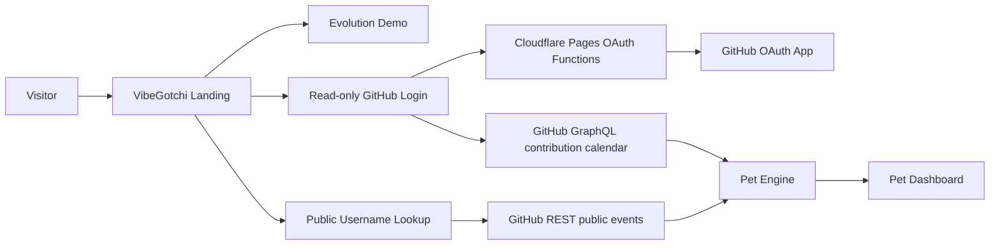

# VibeGotchi


A GitHub-powered virtual pet that evolves from your coding activity.

VibeGotchi turns GitHub activity into XP, health, mood, streaks, and pet evolution stages. Visitors can try a public username lookup without logging in, or use read-only GitHub OAuth on the Cloudflare deployment for a richer contribution-history view.

Live deployments:

- Cloudflare Pages: https://vibegotchi.pages.dev
- GitHub Pages: https://pascalai2024.github.io/VibeGotchi/
- Source: https://github.com/PascalAI2024/VibeGotchi

## Features

- Public GitHub username lookup with no login required
- Read-only GitHub OAuth login on Cloudflare Pages
- Contribution-graph scoring for authenticated users
- Public-events fallback for unauthenticated lookups
- Per-tech badges ranked by how many public owned repos use each language
- Achievement badges for streaks, specialist lanes, polyglot activity, and evolution milestones
- Transparent XP breakdown so users can see why the pet reached its level
- Downloadable share card for demos and social proof
- Pet personality readout based on health, activity, streaks, and tech depth
- Evolution demo for Egg, Baby, Teen, Adult, and Elder stages
- Animated SVG pet with mood, posture, health, XP, and streak display
- Free hosting path for both Cloudflare Pages and GitHub Pages

## How It Works



Authenticated login asks GitHub for `read:user` only. It does not request `repo`, write access, admin access, webhooks, organization access, or private repository contents. The app reads contribution counts and dates, not source code.

## Local Development

Prerequisites:

- Node.js 22
- npm

```bash
npm install
npm run dev
```

Open `http://localhost:3000`.

Useful scripts:

```bash
npm run dev               # Angular dev server
npm run build             # Production SSR-capable build
npm run build:pages       # Static Pages build; auto-detects Cloudflare
npm run build:cloudflare  # Static root-path build for Cloudflare Pages
npm run lint              # ESLint
npm run typecheck:functions
```

## Deployment

Cloudflare Pages is the primary hosted app because it can run the OAuth callback securely. GitHub Pages is kept as a static public/demo deployment.

Cloudflare Pages settings:

```text
Framework preset: None
Build command: npm run build:pages
Build output directory: dist/app/browser
Root directory: /
Node version: 22
```

Required Cloudflare environment variables:

```text
GITHUB_CLIENT_ID=your_github_oauth_client_id
GITHUB_CLIENT_SECRET=stored_as_cloudflare_secret
NODE_VERSION=22
```

GitHub OAuth app settings:

```text
Homepage URL: https://vibegotchi.pages.dev/
Authorization callback URL: https://vibegotchi.pages.dev/auth/callback
OAuth scope requested by app: read:user
```

`npm run build:pages` uses the Cloudflare root base path when Cloudflare sets `CF_PAGES`. GitHub Actions runs the same command without `CF_PAGES`, so GitHub Pages keeps the required `/VibeGotchi/` base path.

More detail:

- [Architecture](docs/architecture.md)
- [Deployment Runbook](docs/deployment.md)
- [Security Notes](docs/security.md)

## Repository Layout

```text
src/app/                 Angular app components, services, and pet engine
functions/api/auth/url.ts Cloudflare Pages Function that creates GitHub OAuth URLs
functions/auth/callback.ts Cloudflare Pages Function that exchanges OAuth codes
public/config.json       Runtime client config
public/vibegotchi-banner.jpeg
scripts/build-pages.mjs  Pages build selector for GitHub vs Cloudflare
```

## Tech Badges

VibeGotchi counts the primary language on each non-fork public owned repository and turns those counts into badge levels:

| Level | Tier | Repo count |
| --- | --- | --- |
| 1 | Bronze | 1-2 |
| 2 | Silver | 3-4 |
| 3 | Gold | 5-9 |
| 4 | Platinum | 10-19 |
| 5 | Legend | 20+ |

The current implementation intentionally uses public repository language metadata only. That keeps OAuth read-only and avoids asking for `repo` access.

## Competition Demo Hooks

- Click any evolution demo card to show a complete pet profile instantly.
- Use `Share Card` on the dashboard to download a PNG summary.
- The dashboard shows the pet's readout, achievements, tech badges, and XP sources without requiring judges to inspect the code.

## License

MIT
