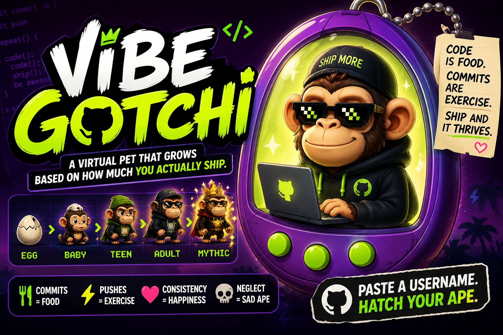
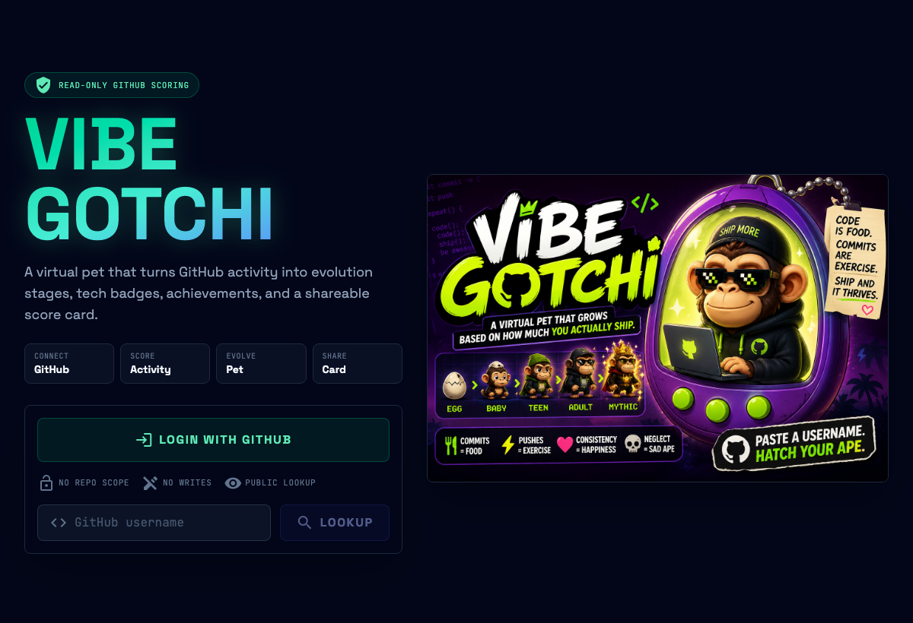
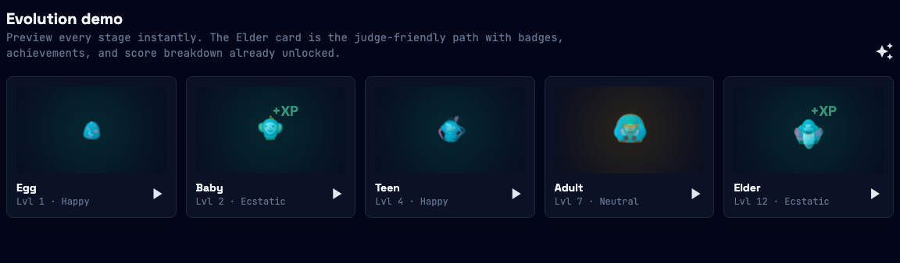
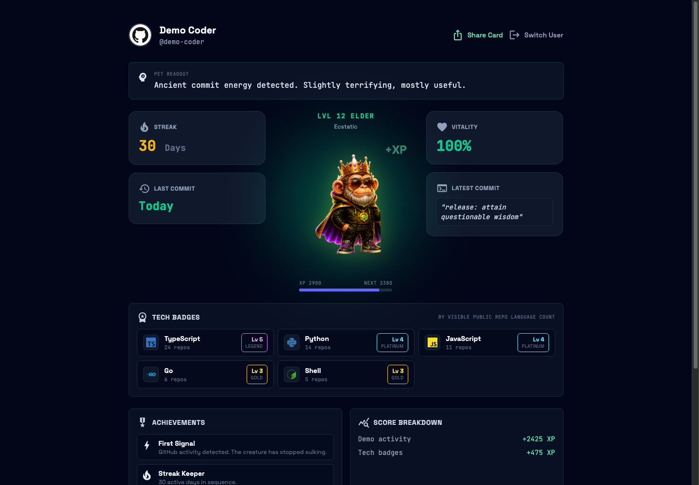
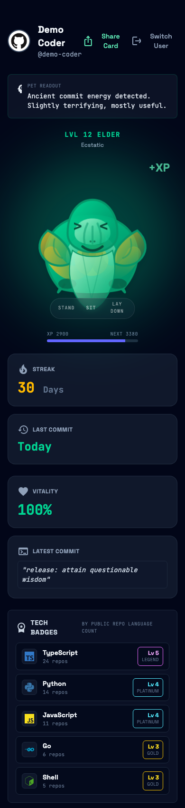
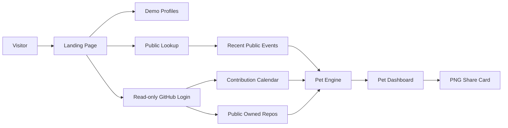

# VibeGotchi

<p align="center">
  
</p>

**A GitHub-powered virtual pet that evolves from coding activity.**

[](https://vibegotchi.pages.dev)
[](https://pascalai2024.github.io/VibeGotchi/)
[](https://angular.dev)
[](LICENSE)

VibeGotchi turns GitHub activity into XP, health, mood, streaks, achievement badges, tech badges, and evolution stages. It is built to be simple enough to understand in a minute, but polished enough for a public product demo.

## Judge This Fast

1. Open https://vibegotchi.pages.dev.
2. Click the `Elder` demo card for the richest dashboard state.
3. Check the read-only OAuth copy, tech-logo badges, achievements, score breakdown, and share card.
4. Optional: log in with GitHub to verify real contribution-history scoring without private repo access.

## Quick Links

| Resource | Link |
| --- | --- |
| Production app | https://vibegotchi.pages.dev |
| Static demo | https://pascalai2024.github.io/VibeGotchi/ |
| Docs index | [docs/README.md](docs/README.md) |
| Architecture | [docs/architecture.md](docs/architecture.md) |
| Scoring model | [docs/scoring.md](docs/scoring.md) |
| Deployment | [docs/deployment.md](docs/deployment.md) |
| Security | [docs/security.md](docs/security.md) |

## Screenshots

<table>
  <tr>
    <td width="50%">
      <strong>Landing</strong><br>
      
    </td>
    <td width="50%">
      <strong>Evolution Demo Cards</strong><br>
      
    </td>
  </tr>
  <tr>
    <td width="50%">
      <strong>Demo Dashboard</strong><br>
      
    </td>
    <td width="50%">
      <strong>Mobile Badge View</strong><br>
      
    </td>
  </tr>
</table>

## Why It Is Interesting

Most GitHub activity demos stop at charts. VibeGotchi makes the activity legible and memorable:

- A pet evolves through `Egg`, `Baby`, `Teen`, `Adult`, and `Elder`.
- Read-only GitHub OAuth unlocks contribution-history scoring.
- Public username lookup works without login.
- Tech badges rank languages by visible public repos, including public org/collaborator repos available to the authenticated account.
- Optional GitHub App enhanced mode reads selected repos with read-only permissions for private/company repo badges and package/framework detection.
- Private and company contribution activity can also be detected through GitHub's contribution graph without reading private repository names or source code.
- Mapped tech badges display official-style SVG logos from [Simple Icons](https://github.com/simple-icons/simple-icons), with text initials as a fallback.
- Achievement badges reward streaks, polyglot work, specialist lanes, and evolution milestones.
- A transparent XP breakdown explains why a user reached their level.
- A downloadable share card gives the demo a clean final artifact.

## Product Flow



## Feature Map

| Feature | Public lookup | GitHub login |
| --- | ---: | ---: |
| User profile | Yes | Yes |
| Recent public events | Yes | Fallback |
| Contribution calendar | No | Yes |
| Tech badges from public repos | Yes | Yes |
| Achievements | Yes | Yes |
| Share card | Yes | Yes |
| Requires `repo` scope | No | No |

## OAuth Scope

VibeGotchi asks GitHub for:

```text
read:user
```

It does **not** ask for `repo`, write access, admin access, workflows, org admin, or private repository contents. Current scoring uses contribution counts, contribution dates, public events, visible public repository language metadata, and GitHub's restricted/private contribution count signal.

Enhanced repo scoring uses a GitHub App, not classic OAuth `repo`. Users install it on selected repositories with `Metadata: read-only` and `Contents: read-only` so VibeGotchi can detect repo languages and package/framework usage without write access.

## Technology Logos

Tech badge icons are loaded from the [Simple Icons](https://github.com/simple-icons/simple-icons) public logo set through `cdn.simpleicons.org`. The app stores only the language-to-icon slug mapping; unsupported languages fall back to a compact text mark.

## Local Development

Prerequisites:

- Node.js 22
- npm

```bash
npm install
npm run dev
```

Open:

```text
http://localhost:3000
```

Useful commands:

```bash
npm run dev               # Angular dev server
npm run build             # Production SSR-capable build
npm run build:pages       # Static Pages build; auto-detects Cloudflare
npm run build:cloudflare  # Static root-path build for Cloudflare Pages
npm run lint              # ESLint
npm run typecheck:functions
```

## Repository Structure

```text
.
├── docs/                         Documentation, diagrams, screenshots
├── functions/                    Cloudflare Pages Functions for OAuth
├── public/                       Public assets and runtime config
├── scripts/                      Build helpers
├── src/app/                      Angular app, dashboard, pet engine
├── .github/                      GitHub Pages workflow and templates
├── angular.json                  Angular build targets
└── package.json                  Scripts and dependencies
```

## Deployment Summary

Cloudflare Pages is the primary deployment because OAuth needs a server-side callback to protect the GitHub client secret.

```text
Build command: npm run build:pages
Build output:  dist/app/browser
Node version:  22
```

Required Cloudflare variables:

```text
GITHUB_CLIENT_ID
GITHUB_CLIENT_SECRET  # Cloudflare Secret
NODE_VERSION=22
```

GitHub Pages is static-only. It supports the demo and public lookup path, but cannot securely exchange OAuth codes.

## Competition Demo Script

1. Open https://vibegotchi.pages.dev.
2. Point out the read-only OAuth note.
3. Click an evolution demo card to show a full dashboard instantly.
4. Highlight tech badges, achievements, and XP breakdown.
5. Click `Share Card` to download the PNG summary.
6. Optionally log in with GitHub to show real read-only contribution scoring.

## Contributing

See [CONTRIBUTING.md](CONTRIBUTING.md). Good first issues include new achievement badges, refined scoring, more demo profiles, and improved share-card layouts.

## License

MIT. See [LICENSE](LICENSE).
