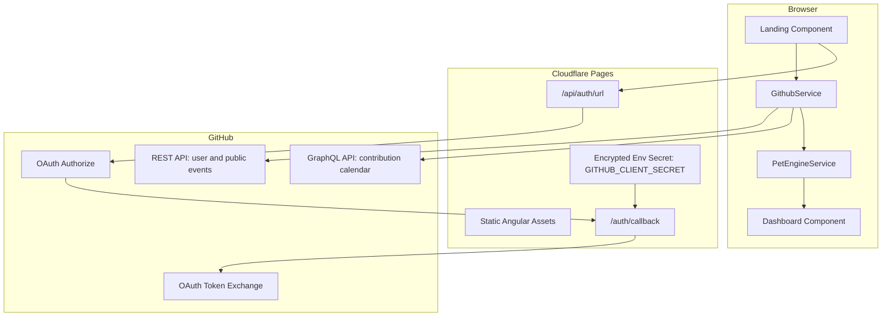
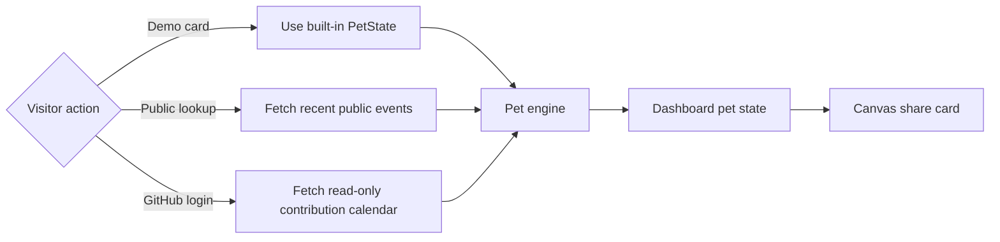
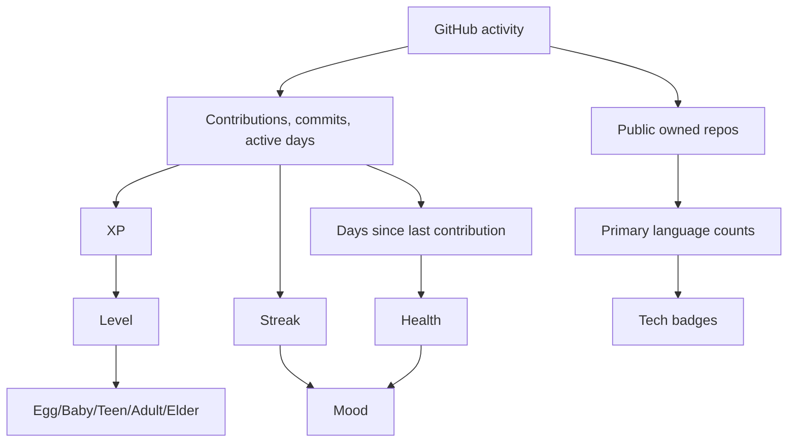
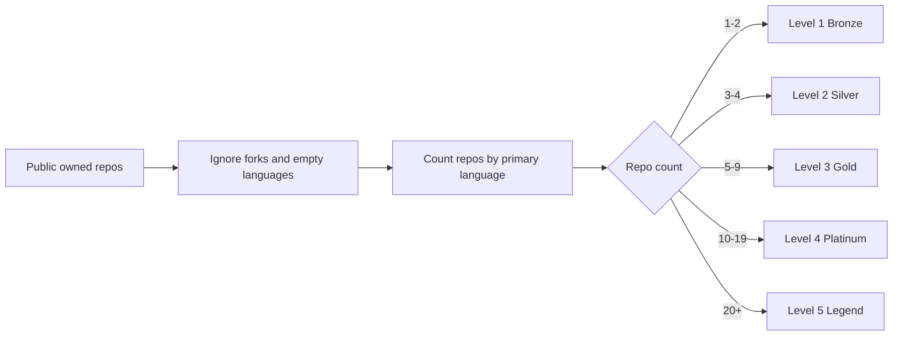

# Architecture

VibeGotchi is an Angular 21 app with Cloudflare Pages Functions for the GitHub OAuth pieces that cannot live safely in a static browser bundle.

## System Schematic

## Runtime Modes

## Data Sources

Public lookup uses:

- `GET https://api.github.com/users/{username}`
- `GET https://api.github.com/users/{username}/events?per_page=100`

Authenticated login uses:

- `GET https://api.github.com/user`
- `POST https://api.github.com/graphql`
- `viewer.contributionsCollection`

The authenticated path is better for real history because the public events feed is recent and limited. The GraphQL contribution calendar gives a year-level contribution view using read-only OAuth.

## Pet Scoring

The scoring logic lives in `src/app/pet-engine.service.ts`.

Dashboard presentation lives in `src/app/dashboard/dashboard.component.ts` and includes achievements, score breakdowns, tech badges, pet readouts, and the canvas-generated share card.

## Tech Badge Ranking

This is deliberately based on repository language metadata rather than source-file inspection. It keeps the app read-only and avoids requesting private repository permissions.
