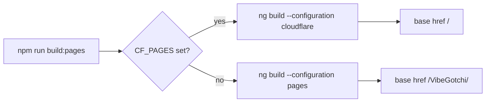

# Deployment Runbook

VibeGotchi is deployed from GitHub to Cloudflare Pages and GitHub Pages.

## Production URLs

- Cloudflare Pages: https://vibegotchi.pages.dev
- GitHub Pages: https://pascalai2024.github.io/VibeGotchi/
- Repository: https://github.com/PascalAI2024/VibeGotchi

## Cloudflare Pages

Cloudflare Pages is the primary production deployment because it supports Pages Functions.

Settings:

```text
Project name: vibegotchi
Git repository: PascalAI2024/VibeGotchi
Production branch: main
Build command: npm run build:pages
Build output directory: dist/app/browser
Root directory: /
Node version: 22
```

Environment variables:

| Variable | Type | Status | Notes |
| --- | --- | --- | --- |
| `GITHUB_CLIENT_ID` | Plaintext | ✅ Configured (verified via `/api/auth/url` → 200) | OAuth App |
| `GITHUB_CLIENT_SECRET` | Cloudflare Secret | ✅ Configured | OAuth App |
| `GITHUB_APP_CLIENT_ID` | Plaintext | ❌ Missing (verified via `/api/github-app/url` → 500) | GitHub App enhanced mode |
| `GITHUB_APP_CLIENT_SECRET` | Cloudflare Secret | ❌ Missing | GitHub App enhanced mode |
| `NODE_VERSION` | Plaintext | Required | Set to `22` |

To verify which secrets are live, curl the endpoints — `200` means the variable is set, `500` with `"... is not configured"` means it is missing. Always probe these before assuming setup state.

After changing environment variables or secrets, retry the latest deployment so Pages Functions pick up the new runtime values.

## GitHub OAuth App

OAuth app settings:

```text
Homepage URL: https://vibegotchi.pages.dev/
Authorization callback URL: https://vibegotchi.pages.dev/auth/callback
Requested scope: read:user
```

Do not request classic OAuth `repo` scope. Use the GitHub App enhanced mode for selected read-only repo access.

## GitHub App Enhanced Mode

Enhanced mode is optional. It lets users install VibeGotchi on selected personal or organization repositories so the app can read repo metadata and package manifests without write access.

### One-click registration

Open this URL while signed into the GitHub account that should own the app (`PascalAI2024` for the live production deploy). The form will be prefilled with the exact required values — just scroll, confirm, and click **Create GitHub App**:

```text
https://github.com/settings/apps/new?name=VibeGotchi&description=GitHub-powered+virtual+pet+that+evolves+with+your+coding+activity.&url=https%3A%2F%2Fvibegotchi.pages.dev%2F&public=true&webhook_active=false&request_oauth_on_install=true&callback_urls%5B%5D=https%3A%2F%2Fvibegotchi.pages.dev%2Fgithub-app%2Fcallback&setup_url=https%3A%2F%2Fvibegotchi.pages.dev%2F&setup_on_update=false&contents=read&metadata=read
```

After the form loads, manually confirm two checkboxes that the prefill does not always carry:

- **Expire user authorization tokens** — enabled
- **Request user authorization (OAuth) during installation** — enabled

### Manual reference

GitHub App settings:

```text
Homepage URL: https://vibegotchi.pages.dev/
Callback URL: https://vibegotchi.pages.dev/github-app/callback
Setup URL (post-install): https://vibegotchi.pages.dev/
Webhook: disabled
Expire user authorization tokens: enabled
Request user authorization during installation: enabled
Public: yes (so other users can install it)
```

Repository permissions:

```text
Metadata: Read-only
Contents: Read-only
```

Do not request write permissions, administration, issues, pull requests, workflows, deployments, or secrets. Users should install the app only on repositories they want VibeGotchi to score.

### After creation

1. On the new app page, copy the **Client ID** → set as `GITHUB_APP_CLIENT_ID` (plaintext) in Cloudflare Pages → Settings → Environment variables → Production.
2. Click **Generate a new client secret**, copy it immediately → set as `GITHUB_APP_CLIENT_SECRET` (Cloudflare **Secret**) in Production.
3. In Cloudflare Pages, **Retry latest deployment** so the Functions runtime picks up the new vars.
4. Verify: `curl -s -o /dev/null -w '%{http_code}\n' 'https://vibegotchi.pages.dev/api/github-app/url?origin=https%3A%2F%2Fvibegotchi.pages.dev'` should now return `200`.
5. Install the app on at least one repository to test the end-to-end flow.

## GitHub Pages

GitHub Pages is static-only. It supports public lookup and demo mode. It cannot safely exchange OAuth codes because it cannot store a client secret.

The workflow is `.github/workflows/pages.yml`.

Repository settings:

```text
Pages source: GitHub Actions
Actions: enabled
```

## Build Selector

`scripts/build-pages.mjs` picks the correct Angular build:



## Verification Commands

```bash
npm run lint
npm run typecheck:functions
CF_PAGES=1 npm run build:pages
curl -s https://vibegotchi.pages.dev/ | rg '<base href="/"'
curl -s -o /dev/null -w '%{http_code}\n' 'https://vibegotchi.pages.dev/api/auth/url?origin=https%3A%2F%2Fvibegotchi.pages.dev'
curl -s -o /dev/null -w '%{http_code}\n' 'https://vibegotchi.pages.dev/api/github-app/url?origin=https%3A%2F%2Fvibegotchi.pages.dev'
```

Expected auth URL status: `200`.
