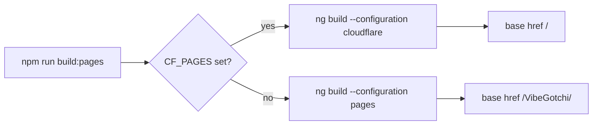

# Deployment Runbook

VibeGotchi is deployed from GitHub to Cloudflare Pages and GitHub Pages.

## Production URLs

- Cloudflare Pages: https://vibegotchi.pages.dev
- GitHub Pages: https://pascalai2024.github.io/VibeGotchi/
- Repository: https://github.com/PascalAI2024/VibeGotchi

## Cloudflare Pages

Cloudflare Pages is the primary production deployment because it supports Pages Functions.

Settings:

```text
Project name: vibegotchi
Git repository: PascalAI2024/VibeGotchi
Production branch: main
Build command: npm run build:pages
Build output directory: dist/app/browser
Root directory: /
Node version: 22
```

Environment variables:

```text
GITHUB_CLIENT_ID      Plaintext is acceptable
GITHUB_CLIENT_SECRET  Cloudflare Secret only
NODE_VERSION          22
```

After changing environment variables or secrets, retry the latest deployment so Pages Functions pick up the new runtime values.

## GitHub OAuth App

OAuth app settings:

```text
Homepage URL: https://vibegotchi.pages.dev/
Authorization callback URL: https://vibegotchi.pages.dev/auth/callback
Requested scope: read:user
```

Do not request `repo` scope unless the product deliberately changes to inspect repository contents. That is not needed for current scoring.

## GitHub Pages

GitHub Pages is static-only. It supports public lookup and demo mode. It cannot safely exchange OAuth codes because it cannot store a client secret.

The workflow is `.github/workflows/pages.yml`.

Repository settings:

```text
Pages source: GitHub Actions
Actions: enabled
```

## Build Selector

`scripts/build-pages.mjs` picks the correct Angular build:



## Verification Commands

```bash
npm run lint
npm run typecheck:functions
CF_PAGES=1 npm run build:pages
curl -s https://vibegotchi.pages.dev/ | rg '<base href="/"'
curl -s -o /dev/null -w '%{http_code}\n' 'https://vibegotchi.pages.dev/api/auth/url?origin=https%3A%2F%2Fvibegotchi.pages.dev'
```

Expected auth URL status: `200`.
