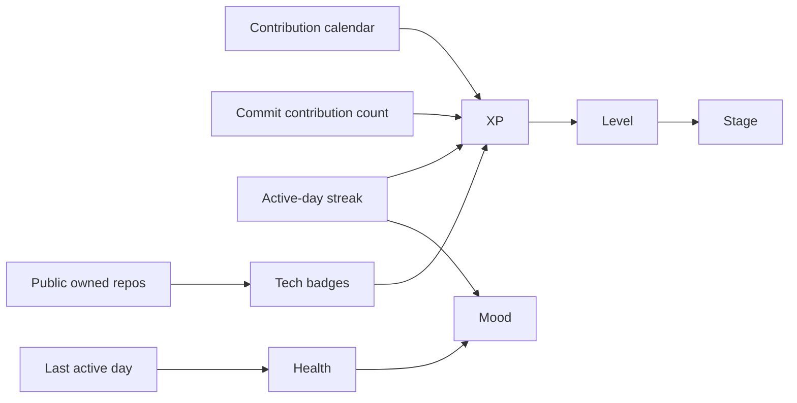

# Scoring Model

VibeGotchi converts GitHub activity into a compact pet profile. The model is intentionally explainable for demos and judging.

> **Unified XP formula**: Both scoring paths (public events and authenticated contribution graph) use the same `SHARED_LEVEL_DIVISOR = 25`. Level is consistent regardless of which data source loaded the profile.

## State Inputs



## XP Sources

| Source | Rule |
| --- | --- |
| Yearly contributions | `totalContributions * 10` |
| Commit contributions | `totalCommitContributions * 5` |
| Active streak | `streakDays * 50` |
| Tech badges | `badgeLevel * 25` for each badge |
| Care freshness | `Thriving: 150`, `Active: 90`, `Resting: 25`, `Neglected: 0` |
| Public lookup fallback | `recentPushes * 15 + streakDays * 50 + badge XP` |

The dashboard exposes these sources in the score breakdown.

**Level calculation** (shared by both scoring paths):
```
level = max(1, floor(sqrt(xp / 25)) + 1)
xpToNextLevel = level² * 25
```

## Evolution Stages

| Stage | Level |
| --- | ---: |
| Egg | 1 |
| Baby | 2 |
| Teen | 3-5 |
| Adult | 6-9 |
| Elder | 10+ |

## Tech Badges

VibeGotchi counts visible non-fork repositories grouped by language ecosystem. This normalizes scoring for polyglot JavaScript/TypeScript developers who use many frameworks across few repos each.

### Ecosystem Scoring

| Ecosystem | Scoring rule |
| --- | --- |
| JS/TS | `min(repoCount, 3) + (uniqueTechCount - 1) * 0.5 + (recent: 1)`; capped at 3 per language, variety + recency bonuses |
| Other (Python, Rust, Go, etc.) | `min(repoCount, 3) + (uniqueTechCount - 1) * 0.5` |

A user with 5 different JS frameworks (React, Vue, Svelte, Astro, Next) — 1 repo each — now earns a meaningful badge instead of no signal. A user with 10 React repos is capped at 3, preventing one language from claiming all credit.

Mapped languages display SVG marks from [Simple Icons](https://github.com/simple-icons/simple-icons). Unmapped languages still receive ranked badges with a text fallback.

Private/company contributions can affect the contribution graph signal. Enhanced mode can also score private/company repository metadata and package manifests when the user installs the GitHub App with read-only access on selected repositories.

### Badge Tiers

| Level | Tier | Score threshold |
| ---: | --- | ---: |
| 1 | Bronze | 1 |
| 2 | Silver | 2 |
| 3 | Gold | 4 |
| 4 | Platinum | 7 |
| 5 | Legend | 10+ |

## Achievements

| Achievement | Unlock |
| --- | --- |
| First Signal | Any detected activity |
| Streak Keeper | 7+ active-day streak |
| Polyglot | 4+ tech badges |
| Specialist | Any badge at level 4+ |
| Elder Maintainer | Level 10+ |

## Personality Line

The pet readout is selected from health, level, streak, badge depth, and mood. This gives the dashboard a bit of character without adding hidden rules.

## Caveats

- **Streak calculation** uses ISO date strings (`YYYY-MM-DD`) to avoid month-boundary collisions (e.g., January 31 and February 1 both becoming `2026-1-31` with un-padded dates).
- **Achievement discoverability** — locked achievements show no progress hints. Partial progress display is a future improvement.
- **Client-side caching** — `GithubService` uses a 5-minute in-memory cache per key to protect the 60 req/hr unauthenticated rate limit.
