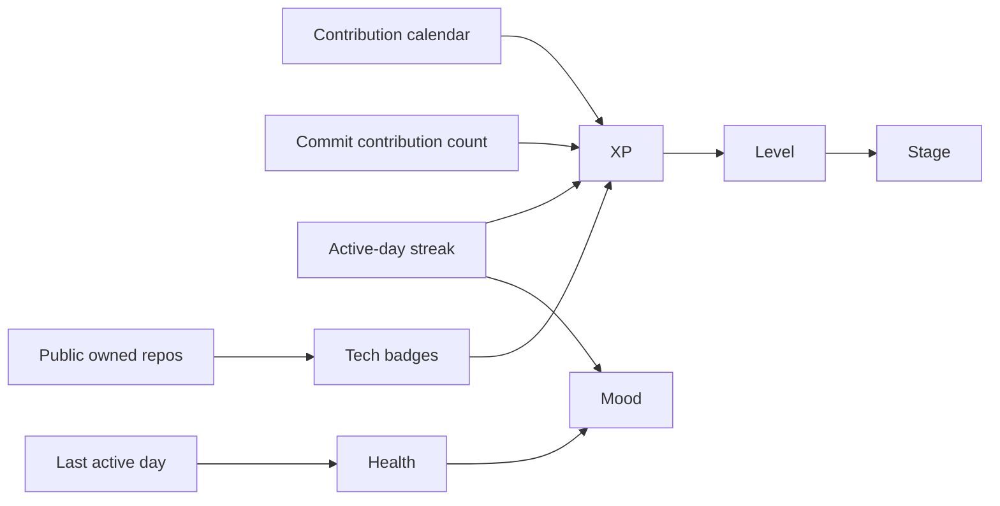
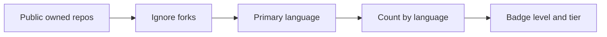

# Scoring Model

VibeGotchi converts GitHub activity into a compact pet profile. The model is intentionally explainable for demos and judging.

## State Inputs

## XP Sources

| Source | Rule |
| --- | --- |
| Yearly contributions | `totalContributions * 10` |
| Commit contributions | `totalCommitContributions * 5` |
| Active streak | `streakDays * 50` |
| Tech badges | `badgeLevel * 25` for each badge |
| Public lookup fallback | `recentPushes * 15 + streakDays * 50 + badge XP` |

The dashboard exposes these sources in the score breakdown.

## Evolution Stages

| Stage | Level |
| --- | ---: |
| Egg | 1 |
| Baby | 2 |
| Teen | 3-5 |
| Adult | 6-9 |
| Elder | 10+ |

## Tech Badges

VibeGotchi counts each visible non-fork repository by its primary GitHub language. Authenticated users can include owned, collaborator, and organization-member repositories that GitHub exposes under the active token.
Mapped languages display SVG marks from [Simple Icons](https://github.com/simple-icons/simple-icons). Unmapped languages still receive ranked badges with a text fallback.

Private/company contributions can affect the contribution graph signal. Enhanced mode can also score private/company repository metadata and package manifests when the user installs the GitHub App with read-only access on selected repositories.

| Level | Tier | Public owned repo count |
| ---: | --- | ---: |
| 1 | Bronze | 1-2 |
| 2 | Silver | 3-4 |
| 3 | Gold | 5-9 |
| 4 | Platinum | 10-19 |
| 5 | Legend | 20+ |

## Achievements

| Achievement | Unlock |
| --- | --- |
| First Signal | Any detected activity |
| Streak Keeper | 7+ active-day streak |
| Polyglot | 4+ tech badges |
| Specialist | Any badge at level 4+ |
| Elder Maintainer | Level 10+ |

## Personality Line

The pet readout is selected from health, level, streak, badge depth, and mood. This gives the dashboard a bit of character without adding hidden rules.
