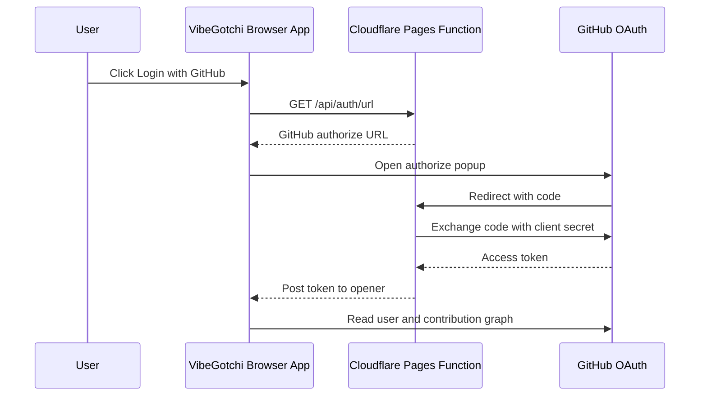

# Security Notes

## OAuth Permissions

VibeGotchi requests only:

```text
read:user
```

That is read-only profile access. The app does not request:

- `repo`
- `workflow`
- `admin:*`
- write scopes
- organization administration

Optional enhanced mode uses a GitHub App instead of classic OAuth `repo`. The GitHub App should request only:

- `Metadata: read-only`
- `Contents: read-only`

Users install the GitHub App on selected repositories or organizations. This is the preferred path for private/company repo scoring because it avoids broad OAuth repo access.

Authenticated scoring uses GitHub's contribution calendar through GraphQL. This gives contribution counts, dates, and restricted/private contribution count signals without reading repository source code.

Tech badges use visible repository metadata and primary language counts. Enhanced mode can also read `package.json` manifests from selected repositories to detect frameworks and libraries such as Angular, React, Next.js, Tailwind CSS, Express, Prisma, Supabase, and Vite. Display logos are loaded from the public [Simple Icons](https://github.com/simple-icons/simple-icons) CDN as SVG images.

## Secret Handling

`GITHUB_CLIENT_SECRET` must be stored as a Cloudflare Pages Secret.

Do not place OAuth secrets in:

- source files
- README examples
- GitHub Actions variables visible to contributors
- screenshots
- issue comments

If the client secret is exposed or accidentally saved as plaintext, rotate it in the GitHub OAuth app, update Cloudflare Pages, redeploy, then delete the old GitHub secret.

## Current Auth Flow



Enhanced mode uses the same popup pattern, but exchanges the code through `/github-app/callback` with the GitHub App client credentials.

## Known Tradeoff

Current limitation: the browser receives the GitHub access token after OAuth and uses it directly against GitHub APIs. Production hardening should proxy GitHub API reads through Cloudflare Functions and keep tokens server-side.
