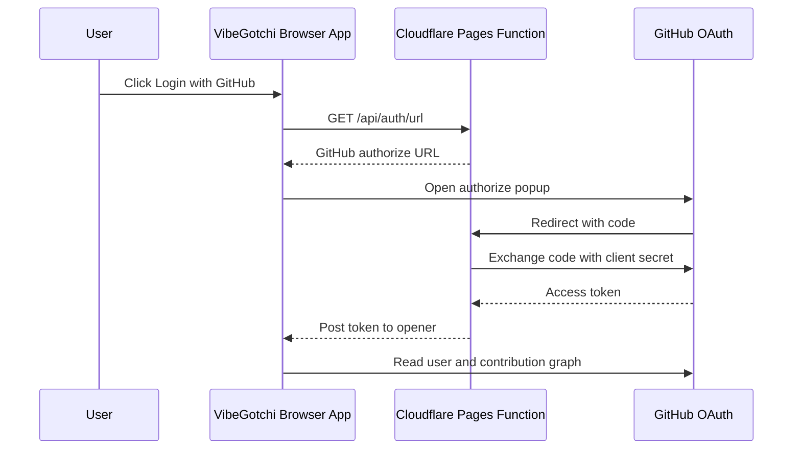

# Security Notes

## OAuth Permissions

VibeGotchi requests only:

```text
read:user
```

That is read-only profile access. The app does not request:

- `repo`
- `workflow`
- `admin:*`
- write scopes
- organization administration

Authenticated scoring uses GitHub's contribution calendar through GraphQL. This gives contribution counts and dates without reading repository source code.

Tech badges use public repository metadata and primary language counts. They do not read repository contents.

## Secret Handling

`GITHUB_CLIENT_SECRET` must be stored as a Cloudflare Pages Secret.

Do not place OAuth secrets in:

- source files
- README examples
- GitHub Actions variables visible to contributors
- screenshots
- issue comments

If the client secret is exposed or accidentally saved as plaintext, rotate it in the GitHub OAuth app, update Cloudflare Pages, redeploy, then delete the old GitHub secret.

## Current Auth Flow



## Known Tradeoff

The current browser app receives the GitHub access token after OAuth and uses it directly against GitHub APIs. That is acceptable for a small open-source demo using read-only scopes, but a more hardened version would proxy all GitHub API reads through Cloudflare Functions and keep the token server-side.
